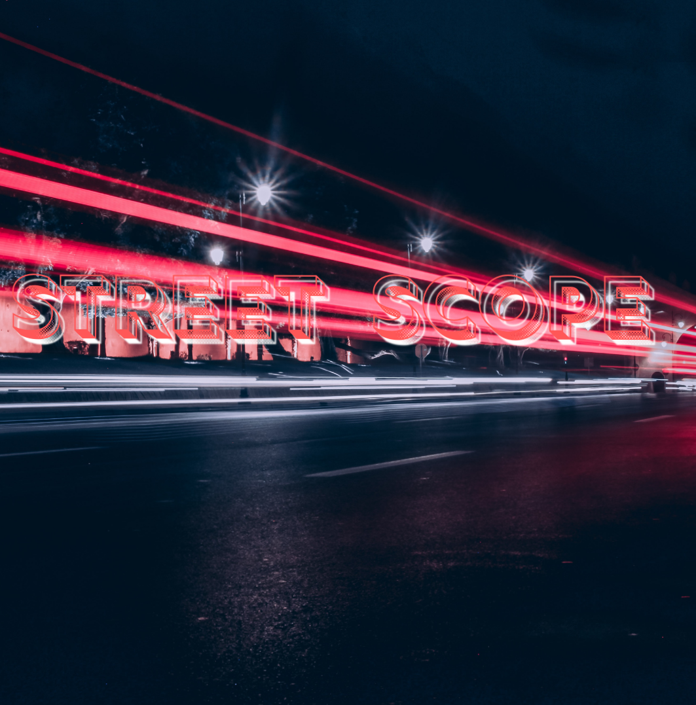

# StreetScope

Spot the next trend before it’s everywhere.

## Status
Just started. Testing ideas, collecting inspiration.

## Possible Features
- Community-submitted trends
- Weekly highlight
- Tag-based trend search
- Social media integration (maybe)

## Folders
/designs → mockups, logos  
/notes → ideas, drafts

---
Started: Aug 2025  
Stage: Concept 

---

## 🚦 Problem  
Cities are full of blind spots — unsafe crosswalks, traffic bottlenecks, and areas where people feel invisible.  
Right now, most monitoring systems are expensive, outdated, or inaccessible to regular citizens.  

---

## 💡 Solution  
StreetScope is a lightweight, open-source project that turns everyday devices into **street-level observatories**.  
Think: community-driven urban insight without needing million-dollar infrastructure.  

---

## 🛠️ Method  
- Collect and organize local observations (images, notes, small datasets).  
- Use open tools + algorithms to analyze safety and traffic patterns.  
- Share results in a clean, accessible way so anyone (students, policymakers, citizens) can understand.  

---

## 🌍 Impact  
StreetScope is about **empowering citizens** to shape safer, smarter streets.  
If scaled, it can:  
- Spot dangerous zones before accidents happen.  
- Help urban planners with real community feedback.  
- Give students (like me!) a platform to learn data, design, and impact-driven work.  

---

## 🔮 Next Steps  
- Add first sample dataset (`notes/ideas.txt` is the brainstorm).  
- Build a minimal prototype analysis tool.  
- Design a cleaner logo + identity.  
- Write tutorials so others can join in.  

---

## 📜 License  
MIT License (open for anyone to use & improve).  

